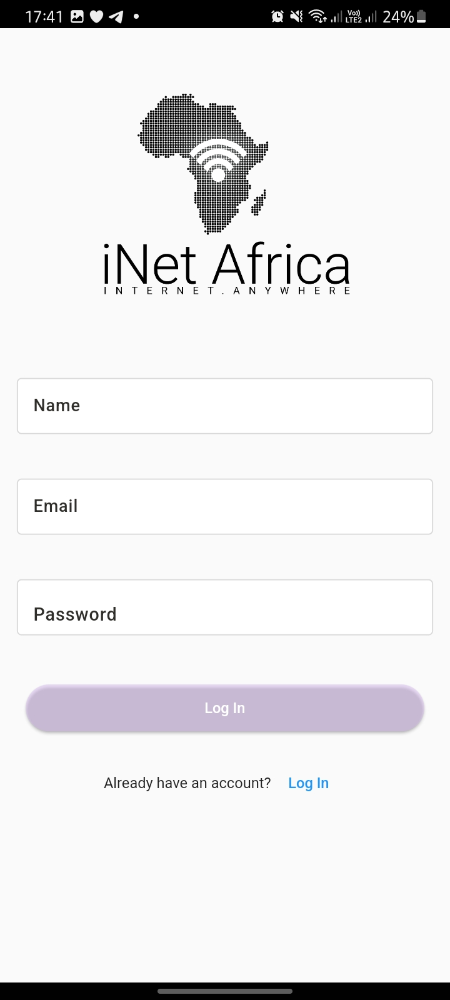
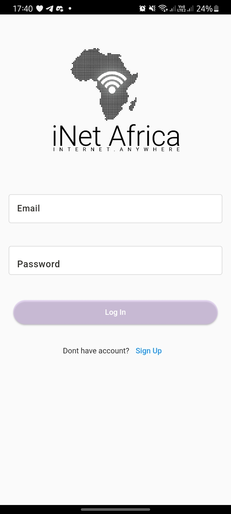
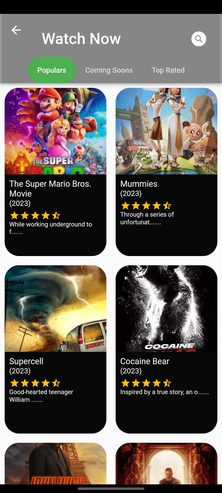
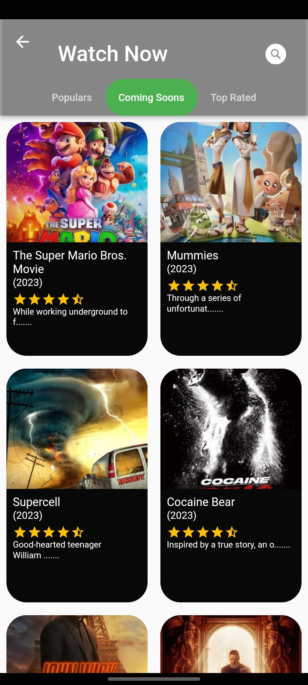
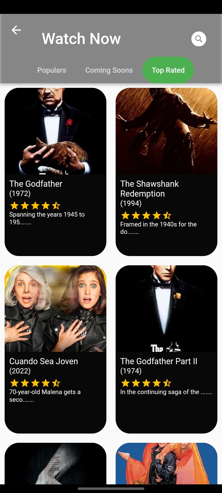
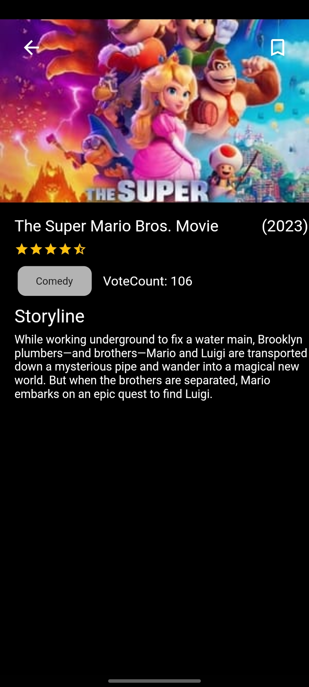
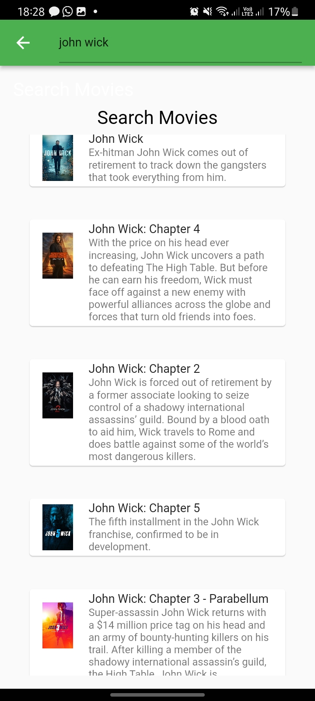

# iNetAfrica - Interview

## Description

Building a simple Flutter application that demonstrates your ability to create a complete and
polished mobile app. We want to see how you integrate with an open-source API and how you structure
and document your code. We would also like you to provide a brief document that describes your app
idea, any challenges you faced during development, and your approach to solving them.

To download click this [link](https://drive.google.com/file/d/1XQm6TRkJl-qzNUDeGeTATzZwtIuAxoDS/view?usp=sharing)

# iNetAfrica Interview Test.

## Mid-Level Developer Pre-screening test

Timeline: 7 days

## Project Requirements
1. The application should be built using the Flutter framework.
2. The application should integrate with an open-source API.
3. The application should be functional and demonstrate your ability to create a complete and polished mobile app.
4. You should provide clear and concise documentation of your code.
5. You should provide a brief document describing your app idea, any challenges you faced, and your approach to solving them.
6. You should submit the code through a GitHub repository link.
7. You should include screenshots of the application.
8. You should also include an APK file for testing purposes.

## Quick Start
This is a normal flutter app. You should follow the instructions in the [official documentation](https://flutter.io/docs/get-started/install).
This project uses **BLoC** (business logic component) [BLoC](https://medium.com/flutter-community/flutter-bloc-for-beginners-839e22adb9f5) to separate the business logic with UI itself.

## Getting Started
This application is using api of <a target="_blank" href="https://www.themoviedb.org/">themoviedb</a>, so before using it you have to create an api from <a  target="_blank" href="https://www.themoviedb.org/">themoviedb</a> and generate an API and apply it to this application, follow the below step to connect api with this app.

First go to <a target="_blank" href="https://www.themoviedb.org/documentation/api">https://www.themoviedb.org/documentation/api</a>, and follow the API Documentation, you will get the API Code.

## Modularization Structure 🔥
# Root Project
    .
    │   
    |
    └── lib                        # Name of module (default from Flutter).
        |── core                   # Name of module.
        |── data                   # Network calls.
        ├── presentations          # Activity/View layer
        │   ├── bloc               # Business logic component.
        ├── theme                  # App styling themes.
        ├── widget                 # Styles for app.

## Built With 🛠
* [BLoC Pattern](https://bloclibrary.dev/) - Business logic component to separate the business logic with UI.
* [Equatable](https://pub.dev/packages/equatable) - Being able to compare objects in `Dart` often involves having to override the `==` operator.
* [Dio](https://github.com/flutterchina/dio/) - A type-safe HTTP client.
* [Json Serializable](https://pub.dev/packages/json_serializable) - Builders for handling JSON.
* [Shared Preferences](https://pub.dev/packages/shared_preferences) - Cache implementation approach.
* [Modularization](https://medium.com/flutter-community/mastering-flutter-modularization-in-several-ways-f5bced19101a) - Separate functionality into independent, interchangeable modules.
* [Shimmer](https://pub.dev/packages/shimmer) - Loading handler.
* [Flutter Launcher Icons](https://pub.dev/packages/flutter_launcher_icons) - Launcher icons handler.
* [Flavor](https://medium.com/@animeshjain/build-flavors-in-flutter-android-and-ios-with-different-firebase-projects-per-flavor-27c5c5dac10b) - Handling different environments for development and production.
* [Codemagic](https://blog.codemagic.io/environments-in-flutter-with-codemagic-cicd/) - Handling DevOps CI/CD for pipeline and automatically build.
* Handle State - (Loading, No Data, Has Data, No Internet Connection, Request Timeout, Error)
* [Build Release for Android](https://flutter.dev/docs/deployment/android) - Available on the [Play Store](https://play.google.com/store/apps/details?id=id.rifafauzi.movie)
* [Youtube Player](https://pub.dev/packages/youtube_player_flutter) - Play Trailer Video.
* [Extension Methods](https://dart.dev/guides/language/extension-methods)
* [Pull To Refresh](https://pub.dev/packages/liquid_pull_to_refresh) - Handle Pull to Refresh the Content
* [Get It](https://pub.dev/packages/get_it) - A Dependency Injection
* [Firebase](https://firebase.google.com) - Firebase auth using email and password

## How to run the App
1. Clone this project.
2. Open with your favorite tools editor.
3. Run `Pub get` on each module sequentially starting from `dependencies`, `core`, `shared`, and `your root project` to generated `pubspec.lock` file.
4. Add your `API_KEY` into ***api_constant.dart*** file. 

## Project Screenshots
- Projects starts from the splash screen and goes to the login page
  | Splash screen                                                                                                                       | Registartion screen                                                                                                                         |    Login Screen                                                                                                                 |
  | ------------------------------------------------------------------------------------------------------------------------------------ | ------------------------------------------------------------------------------------------------------------------------------------ | ------------------------------------------------------------------------------------------------------------------------------------ |
  |  |  | 
- Projects moves to the home page
    | Upcoming Movie screen                                                                                                                       | Coming Soon Movie screen                                                                                                                         |    Top Rated Screen                                                                                                                 |
    | ------------------------------------------------------------------------------------------------------------------------------------ | ------------------------------------------------------------------------------------------------------------------------------------ | ------------------------------------------------------------------------------------------------------------------------------------ |
    |  |  | 
- Search and Details screen
  | Details Screen                                                                                                                       | Search movie screen                                                                                                                         |                                                                                                                    |
  | ------------------------------------------------------------------------------------------------------------------------------------ | ------------------------------------------------------------------------------------------------------------------------------------ | ------------------------------------------------------------------------------------------------------------------------------------ |
  |  |  | 

